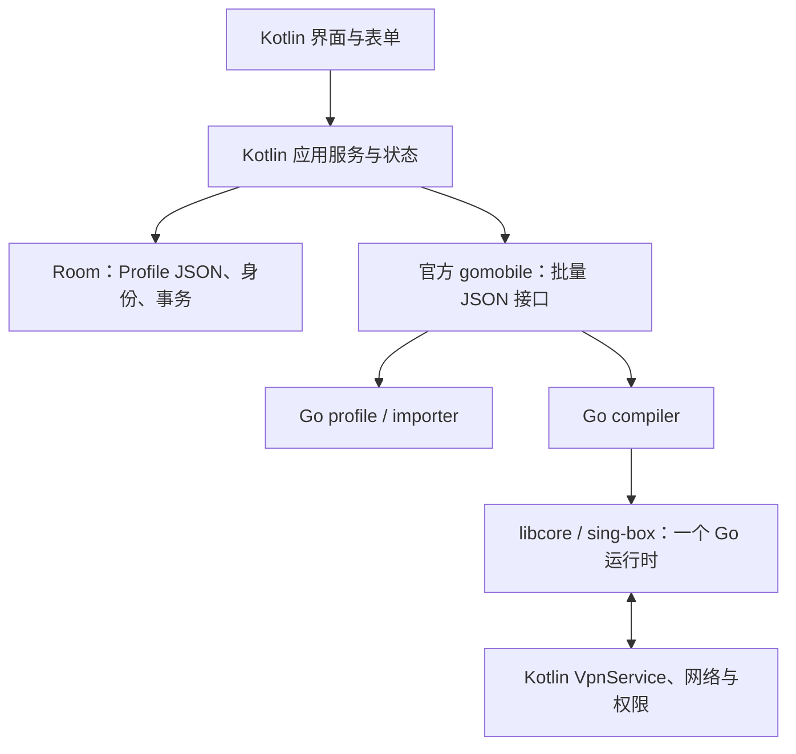

# Vialen 新客户端：Kotlin + Go

状态：新架构已实现，迁移初验完成 53 项真机回归。1.7.6 已修复后续审查发现的四项问题并整合主页和 URL 测试改动，222 项 JVM 回归、7 项真机定向回归及构建检查通过。采用全新数据库，不提供旧客户端数据迁移。最新验证边界见 [1.7.6 审查修复记录](../qa/go-core-review-fixes-1.7.6.md)。

## 架构决定

选择 Kotlin 管 Android 与应用状态，Go 管协议、配置和 sing-box。保留官方 gomobile 生成的 Java/JNI、Android Java 工具链、AIDL 与 ViewBinding；不维护自制 JNI 框架。新业务核心无 Rust 依赖。

减少的是独立业务实现和必须维护的工具链。少量既有 Java 表单/Android 辅助类继续复用；它们不定义新的协议存储格式或生成运行配置。无需为了文件扩展名再重写成熟基础设施。

| 职责 | 唯一负责人 | 边界 |
| --- | --- | --- |
| 节点 URI、订阅格式、协议字段校验 | Go `core/profile`、`core/importer` | 无数据库、Android 或网络 I/O |
| DNS、路由、链、selector、核心配置 | Go `core/compiler` | 接收冻结的应用意图，输出配置与引用元数据 |
| 批量导入、校验、编译、导出 | Go `core/api` | 严格 JSON、输入上限、明确错误 |
| 节点身份、刷新匹配、去重、排序、事务 | Kotlin | 用完整 Profile 语义去重，不能只按服务器地址合并 |
| 界面、权限、VPN 服务、网络变化与调度 | Kotlin | Android 生命周期由 Android 层负责 |
| 连接、DNS 执行、流量与协议运行 | `libcore` / sing-box | 数据包留在 Go/TUN 路径，业务桥接不逐包搬运 |

## 数据与接口

节点保存为 `ProfileDocument(kind=node, profile=Profile)`，链保存有序引用，完整配置和原始出站分别使用独立文档。Room 使用新的数据库名和 version 1；不读取、删除或迁移旧文件。

2026-09-12 用户在正式包覆盖安装出现空白首页后明确确认“以全新客户端开始”。新客户端使用 `vialen_preferences.db` 与 `vialen_profiles.db`，以空白节点列表和默认设置起步；旧 `configuration.db` 与 `sager_net.db` 不纳入兼容、恢复或清理范围。空白首页属于已接受的首次使用行为。当前未验证旧生产数据库的完整性，不能用空列表判断旧数据已被删除，也不能将独立 Debug 包的数据回归结果视为旧生产数据保全证明。

Java Bean 只作现有表单的临时投影。保存时将编辑差异合并回原始 Profile，保留表单没有表达的请求头、TLS、WireGuard 参数等。Room 真正持久化 `document` 列；重读和编辑后重读都有独立测试。

业务桥接只有四类操作：

1. `import`：整个文档 → Profile 列表与逐条诊断。
2. `validate`：整批 Profile → 校验成功或错误，不逐节点调用 JNI。
3. `compile`：Profile、链、规则、DNS、平台能力 → sing-box 配置及 tag 映射。
4. `export`：Profile → 标准 URI；不能无损表达时明确失败，用户可分享完整 Profile JSON。

订阅部分解析错误或空结果不能替换已保存的组。有意义的省略警告对手动操作可见。来源标识 `sourceKey` 与本地 Profile ID/Room ID 分离；刷新中的重复来源先按完整语义匹配，再按明确顺序匹配。数据库事务结束后通知 UI。

路由条件在同一类别内取 OR，不同类别之间取 AND。选中的规则集引用之间取 OR，并与目的 IP 等其他条件共同满足；规则集内部逻辑保持不变。本地 SRS 只携带本地路径，远程集合才携带下载出站与首次启动文件。真机同时覆盖了匹配转发、不匹配拦截和首次启动本地缓存，避免仅凭编译成功判断语义正确。

导入文本最多 16 MiB、节点最多 10,000；ZIP 同时限制总解压预算与条目数。JSON 传输另有 20 MiB 编码后上限。取消订阅任务会取消原生请求并等待其退出，取消后不会进入数据库提交。

## 新客户端的功能取舍

- 支持当前常用 SOCKS、HTTP、Shadowsocks、VMess、VLESS、Trojan、Hysteria 2、TUIC、WireGuard、AnyTLS、ShadowTLS。
- 保留当前核心支持的 ECH、UoT、multiplex、Reality、HY2 调优等表单能力；不把“没有旧版本兼容”解释为丢掉现行协议能力。
- 不保留 Universal/Kryo 节点分享、旧 canonical wire、VCW1、旧 Rust 差分/排名接口、旧解析器容错怪癖。
- Hysteria 表单只提供 Hysteria 2。流量嗅探提供关闭和路由判断；已过时的目标覆盖方式退出界面。
- 结构化节点不再叠加任意 JSON 覆盖。需要完整控制时使用独立原始出站或完整配置模式，避免多处配置互相覆盖。
- 原始出站由 typed sing-box option 解码并纳入链/selector；生成器拥有 tag、detour 等引用，禁止用户覆盖它们。

## 工具链

固定 Go 1.27.1、sing-box 1.14.0 及仓库既有补丁、官方 x/mobile `v0.0.0-20260908204917-8b95e45f8d3e`、JDK 25、NDK 28.1.13356709。官方 gomobile 已实际构建 Android arm64 AAR。原先 gomobile 分支在 Go 1.27 下存在构建兼容问题，因此改用已验证的官方工具，减少私有分支维护。

主机合同测试调用同一个 Go API 的本地执行程序；Android 调用同一模块编入的 AAR。主机通过不代表 Android native、R8、设备或 VPN 已通过。

## 验证与性能判断

独立验证包括：Go 单测/race/fuzz；Android 模型与实际 Room 往返；真实固定版本 sing-box 构造/关闭；selector 实际切换；原生 HTTP 取消与大小上限；Android 导入/订阅/生命周期测试；Debug 与 Release/R8 构建；APK 原生库、16 KiB 对齐、源码与产物来源检查。

性能收益的合理预期来自移除第二个原生业务库、重复解析/转换和细碎 JNI 调用。不能据此承诺更低内存或更高吞吐。Go 有 GC，JSON 传输仍有分配和复制；包体、PSS、批量导入耗时、启动与真实网络表现必须实测。

`NewClientCoreNativeTest` 记录 1000 节点导入、保存/重读、编译阶段耗时及 PSS/ART 分配量；它不把主机微基准当作手机端速度，也不在未做可比实验时声称比 Rust 更快。

迁移初验版本为 1.7.4，源码 VERSION_CODE=62（ARM64 APK versionCode=310）。211 项 JVM 测试零失败、零跳过；Go business race、完整 libcore 测试、Debug/AndroidTest/Release 构建及 Release lint 通过。APK 无 Rust 库，AAR/APK 的 ARM64 与 ELF 16 KiB 对齐检查通过。原生来源校验使用固定 NDK 重现 AGP 的 strip，再精确比较 AAR 与 APK 中的库，保留工具版本、输入与输出哈希。

2026-09-12 在已连接的 25113PN0EC（Android 17 / API 37）上完成 53 项测试，整批 50.139 秒、零失败、零忽略：

- 真实 gomobile 导入、批量校验、Room 往返、编译与核心构造，订阅更新及不完整结果保护。
- 原生 HTTP 取消后连接退出、16 MiB 响应上限、涵盖响应体等待的 30 秒总超时。
- selector 实际切换、Binder 名称更新、流量独立统计与编辑保留。
- 实际 TUN HTTP 流量、本地二进制 SRS、远程 SRS 首次启动缓存、停止重连和节点切换；不匹配测试在同一 VPN 会话前后各验证成功流量，再核对负向连接 EOF/reset 与代理接入计数。
- WorkManager 在同一后台 PID 完成两个请求 UUID，具有 Worker SUCCESS、原生请求退出、VPN 移除、偏好和恢复文件清理证据。
- 25 项真实 Activity 表单、主页状态、列表回收、排序、失败恢复与重建测试。

验收后数据库完整性正常，组、节点、规则和偏好内容与测试前逐行一致；无运行中的 instrumentation、Debug 服务或 TUN。手机保持原始 1220×2656、520 dpi、字号 1.0；首页空态已实际查看。一次 Debug 采样中，1000 节点导入 72.25 ms、保存重读 303.34 ms、编译 224.71 ms、核心构造关闭 138.92 ms，总计 739.22 ms；PSS 从 153019 KiB 到 210977 KiB。这是单设备验收采样，不是 Release 基准或 Rust 对照，不据此承诺吞吐、耗电或内存改善。真实蜂窝/Wi-Fi 切换、长时间耗电与所有协议的远端服务器互通未在本轮覆盖。

历史真机测试回执、设备状态与请求追踪信息仅在本地保留，不随源码公开。该阶段的 Release APK 为未签名构建候选，未作为正式发行版发布。删除的旧实现和专用兼容测试均移入系统垃圾篓，可恢复；原工作树与旧数据库保留。
